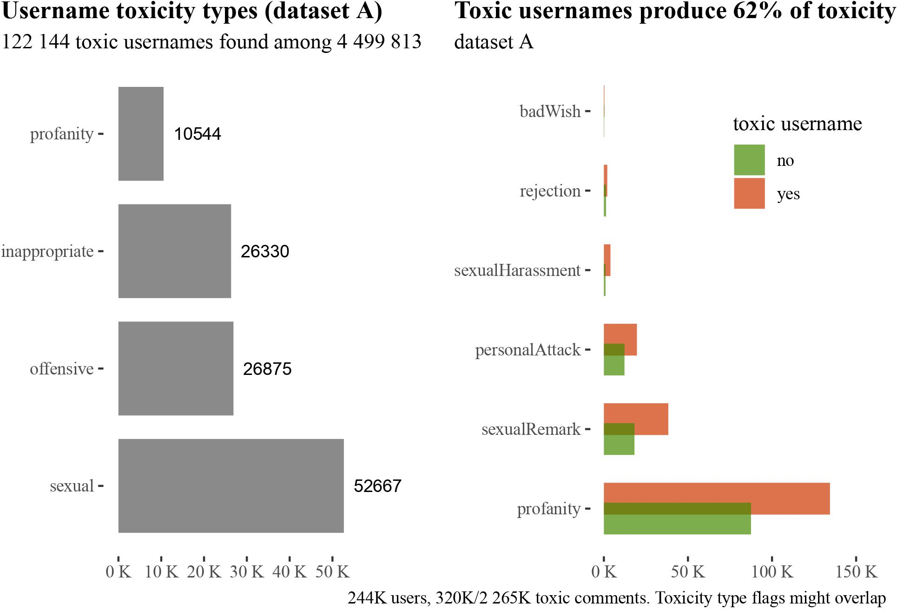

Documentation and data for our paper "Namespotting: username toxicity and actual toxic behavior on Reddit" published in Computers and Human Behavior.

**Abstract** Without relying on any user reports, we use algorithmic detection and Bayesian statistical methods to analyse two large data streams (329k users) of Reddit content to study the correlations between username toxicity (of various types, such as offensive or sexually explicit) and their online toxic behavior (personal attacks, sexual harassment among others).  As it turns out, username toxicity (type) is a useful predictor in online profiling. Users with toxic usernames produce more toxic content than their neutral counterparts, with the difference in predicted mean increasing with activity (predicted 1.9 vs. 1.4 toxic comments a week for users with regular activity, and 5.6 vs. 4 for top 5\% active users). More users with toxic usernames engage in toxic behavior than among neutral usernames (around 40\% vs. 30\%). They are also around 2.2 times more likely to have their account suspended by moderators (3.2\% vs. 1.5\% probability of suspension for regular and 4.5\% vs. 2\% for top 5\% users)---detailed results vary depending on the username toxicity type and toxic behavior type. Thus, username toxicity can be used in the efforts of online communities to predict toxic behavior and to provide more safety to their users.

- All the datasets are available in [this folder](https://drive.google.com/drive/folders/1Yqq8TPLR3yMPx18n9oEOpHbEzcWae9Vw?usp=sharing).
- The R markdown file containing all the analysis code is available [here](https://github.com/rfl-urbaniak/namespotting/blob/main/namespottingTechnical.Rmd).
- The pdf file with the technical analysis is available [here](https://rfl-urbaniak.github.io/namespotting/namespottingTechnical.pdf).

